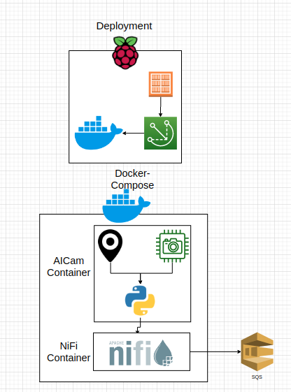
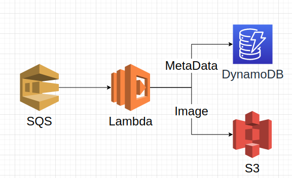

# About



## Environment Variables
```zsh
# Base URL to send HTTP post to
# BASE_URL=127.0.0.1

# Vertical invert camera
# CAMERA_INVERT=False

# Raspberry Pi camera number according to https://picamera.readthedocs.io/en/release-1.13/api_camera.html#picamera
# CAMERA_NUMBER=0

# Device Name
# DEVICE_NAME=simul8

# Baud rate on GPS
# GPS_BAUD_RATE=9600

# Serial port for GPS
# GPS_SERIAL_PORT=/dev/ttyAMA0

# Pytorch Model Location
# MODEL_PATH=/opt/model
```




# Usage
```zsh
Usage: aicamera [OPTIONS] COMMAND [ARGS]...

Options:
  --camera_number INTEGER  Raspberry Pi camera number according to https://pic
                           amera.readthedocs.io/en/release-1.13/api_camera.htm
                           l#picamera, Default: 0
  --camera_invert BOOLEAN  Vertical invert camera, Default: False
  --baud_rate INTEGER      Baud rate on GPS, Default: 9600
  --serial_port TEXT       Serial port for GPS, Default: /dev/ttyAMA0
  --model_path TEXT        Pytorch Model Location, Default: /opt/model
  --help                   Show this message and exit.

Commands:
  to_file
  to_http
```

## to_file
```
Usage: aicamera to_file [OPTIONS]

Options:
  --file_path TEXT  Directory to save predictions to
  --help            Show this message and exit.
```
## to_http
```
Usage: aicamera to_http [OPTIONS]

Options:
  --base_url TEXT  Base URL to send HTTP post to, Default: 127.0.0.1
  --help           Show this message and exit.
```


## Setup
### Scripted
Required commands are found in ```foo.bar``` of this repo which can be run with 
```bash
chmod u+x foo.bar
./foo.bar
```
### Manual

Enable Camera with 
```
sudo raspi-config nonint do_camera 1
```
install picamera 
```
sudo apt-get install python-picamera python3-picamera
```
Add required users to the dialout role to access UART
```zsh
usermod -a -G dialout pi
usermod -a -G dialout ggc_user
```
Enable UART
```echo 'enable_uart=1' >>/boot/config.txt```
reboot
```bash
sudo reboot
```


run docker container
```zsh
docker run --privileged -v /dev/ttyS5 -v /dev/
```