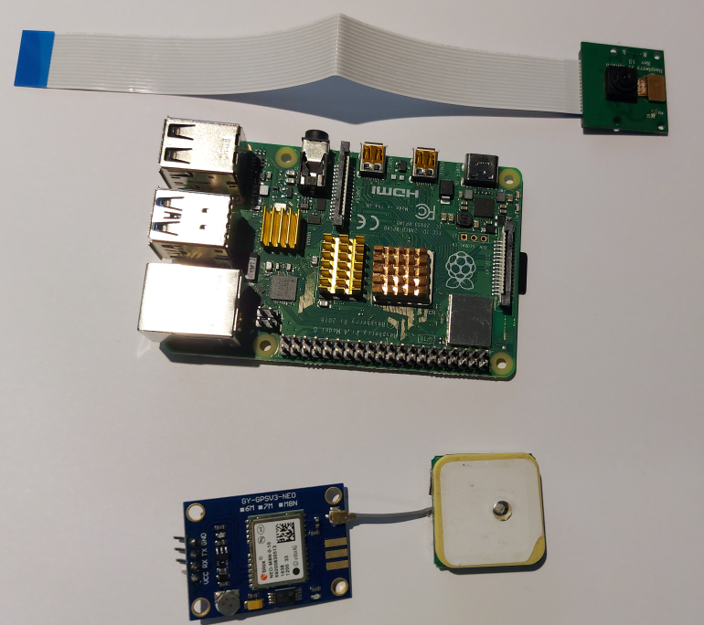
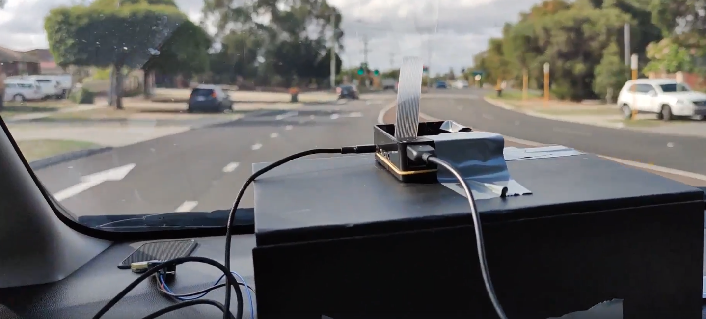

# Pothole AI


Pothole AI was designed after looking at a dashcam and asking "what if we took the video it recorded and did some edge
 analytics to figure out if the road needs to be resurfaced".

It consists of two parts: The Raspberry Pi based Camera using a Pytorch model to do edge inference of road quality 
and a website to aggregate readings and provide a full view of road conditions. The idea behind this is for members of 
the community to automatically be recording road conditions and uploading them to a central site so that local government
 can use the geographic density and confidence of the data to pinpoint where they should be spending the effort to fix.
 
We believe that a solution like this is required because cases of 
[a village throwing a birthday party for a pothole](https://metro.co.uk/2018/03/26/village-hold-first-birthday-party-for-pothole-outside-their-home-7417952/)
or a man filling in potholes while holding a sign saying ["I filled the potholes, pay me instead of your taxes"](https://www.cbc.ca/news/canada/nova-scotia/stellarton-man-given-cash-coffee-cannabis-filling-potholes-1.5072477) indicates that there is probably some room for improvement in the current situation.

On the more serious side, there are serious concequences of potholes including 
* Annual average cost to vehicles of $377 due to rough pavement
* Of approximately 33,000 traffic fatalities each year, one-third involve poor road conditions.

[source](https://www.pothole.info/the-facts/?fbclid=IwAR2AuMlIfkB8Fn3R-sgHxtHWIQdgjbj1CSIB3MS2yLx222Bqm5jGa3NnleU)

## Hardware

[Raspberry Pi 4B](https://core-electronics.com.au/raspberry-pi-4-model-b-2gb.html)
[Ublox Neo M8 GPS](https://www.aliexpress.com/item/32325420719.html?spm=a2g0o.productlist.0.0.34ef5707Xfqbmh)
[Pi Camera](https://www.aliexpress.com/item/32846859601.html?spm=a2g0o.productlist.0.0.307623feOckDyl)
[Optional: 3A Power Bank](https://www.amazon.com/gp/product/B07H6LB4J4/ref=as_li_ss_tl?ie=UTF8)
[Optional: USB to FTDI converter](https://www.aliexpress.com/item/32826575637.html?spm=a2g0o.productlist.0.0.cfc529b09MN7sa)
[Optional: Raspberry Pi Heatsink](https://www.aliexpress.com/item/4000348002518.html?spm=a2g0o.productlist.0.0.51b05477h9g8bc)

To build this system we used a Raspberry Pi 4B with a PiCam v2 and a Neo M8 GPS. The raspberry pi was responsible for
getting the current GPS position, taking a picture, running the pytorch model to get a bad road/good road score and
send this information to an AWS Lambda function which would then store the score, latitude, longitude, device name
 and image into a database.

We would not recommend replacing the Pi Camera with a generic USB camera as the way we have written our code assumes a Pi Camera and results will be uncertain with a USB Camera.

You can substitute the Ublox Neo M8 GPS with a lot of different other models, so long as they support sending NMEA strings over UART and are powered by 3.3v-5v. 
We ended up passing ours through a FTDI -> USB header so we didn't need to worry about mucking around with the Raspberry Pis GPIO pins.
 
 

After observing our system we would make three recommendations:
1. We would highly suggest putting a heatsink on the raspberry pi as it gets hot when doing inference like this.
2. We would suggest putting the camera slightly elevated on your cars dashboard. You may notice a ducted taped box that ours was sitting on.
We ended up discarding a lot of our initial readings because too much of the field of view was blocked by the windscreen wipers.

3. Use a USB powerbank instead of a USB slot powered by your car.The Raspberry Pi is very particular about current/voltage.


## Software

### Deep learning
Deep learning can be very intimidating at first, and taking inspiration from [Fast.ai](https://www.fast.ai/) we wanted to show how easy it is to get something that works.

See notebook [] for a full end to end downloading and training example that will output a model.

We took the dataset curated by the amazing [M.J Booysen](https://www.researchgate.net/profile/Mj_thinus_Booysen) [1] [2].
Which is an annotated dataset of labeled images of roads with an without potholes. 
While this dataset initially is meant to be used for localisation (finding potholes in images), we chose to use it as 
a classification dataset (potholes or no potholes).

We used the Pytorch hosted MobileNet V2 network, which is pretrained on Imagenet. 
This is a convolutional neural network which is small enough to be used in embedded applications.

We then cut off the classification layer to change it from trying to predict 1000 classes to just two.
```pytorch
Existing classifier
Sequential(
  (0): Dropout(p=0.2, inplace=False)
  (1): Linear(in_features=1280, out_features=1000, bias=True)
)
New classifier
Sequential(
  (0): Dropout(p=0.2, inplace=True)
  (1): Linear(in_features=1280, out_features=2, bias=True)
)
```
We used transfer learning to speed up the training process, freezing the intial weights of the imagenet trained model, 
and trained only our classifier. We then progressivly unfroze more weight and trained at lower learning rates.

Once we had our saved model, we used this to perform inference on the raspberry pi, to allow us to only send data when the predicted score reached above a custom theshhold to conserve bandwith.
### Raspberry Pi
The Raspberry Pi software is available as a command line tool that can be installed with either ```pip``` or ```conda```.

It supports sending data to multiple endpoints (Aws SQS, HTTP Post, stdout or to a file) and is configurable via command line inputs and environment variables.

You can view the help command by typing --help on any of the commands provided by the cameraai python package.
#### CLI
```zsh
Usage: aicamera [OPTIONS] COMMAND [ARGS]...

Options:
  --camera_number INTEGER    Raspberry Pi camera number according to https://p
                             icamera.readthedocs.io/en/release-1.13/api_camera
                             .html#picamera, Default: 0
  --camera_invert BOOLEAN    Vertical invert camera, Default: False
  --baud_rate INTEGER        Baud rate on GPS, Default: 9600
  --serial_port TEXT         Serial port for GPS, Default: /dev/ttyUSB0
  --model_path TEXT          Pytorch Model Location, Default:
                             /home/pi/pytorch.model
  --device_name TEXT         Device Name, Default: devpi
  --min_predict_score FLOAT  Minimum prediction score to send, Default: 0.5
  --help                     Show this message and exit.

Commands:
  to_file
  to_http
  to_sqs
  to_stdout
```
####  Environment Variables
Most of these CLI options are also exposed as environment variables.
```zsh
# Base URL to send HTTP post to
# BASE_URL=127.0.0.1

# Vertical invert camera
# CAMERA_INVERT=False

# Raspberry Pi camera number according to https://picamera.readthedocs.io/en/release-1.13/api_camera.html#picamera
# CAMERA_NUMBER=0

# Device Name
# DEVICE_NAME=simul8

# Baud rate on GPS
# GPS_BAUD_RATE=9600

# Serial port for GPS
# GPS_SERIAL_PORT=/dev/ttyAMA0

# Pytorch Model Location
# MODEL_PATH=/opt/model
```
### Website


## Setup guide
### Website

### Pi
#### Install Pytorch
```
sudo apt install libopenblas-dev libblas-dev m4 cmake cython python3-dev python3-yaml python3-setuptools
git clone --recursive https://github.com/pytorch/pytorch
git submodule update --remote third_party/protobuf
sudo -E USE_MKLDNN=0 USE_QNNPACK=0 USE_NNPACK=0 USE_DISTRIBUTED=0 BUILD_TEST=0 python3 setup.py install
```
### Install Torchvision


### Model Prediction


## Challenges we ran into

## What we ran into problems with
### No prebuilt python wheels on PiPi for Arm71
Currently pipi does not have any Armv71 (Raspberry Pis current architecture) wheels for pytorch. 
There are currently some issues compiling Pytorch from source on a Raspberry Pi [shout out to Minki-Kim95 for their post of how to fix this.](https://github.com/pytorch/pytorch/issues/26455.) Compiling pytorch on a Raspberry pi took 2+ hours.
 
The version of torchvision in PiPi for Arm71 is very old and does not support ```torchvision.models```. The latest version also had to be compiled from source (this was a lot faster).

### Edge deployment
Initially we were planning to use AWS Greengrass to deploy the model to the cloud. What we found when writing the guide
 was that it was becoming too complicated to write for someone who didn't have extensive AWS experience to follow so we scrapped it.

### Disk Persistence 
Initially as part of the AWS Greengrass deployment we were going to use [Apache NiFi](https://nifi.apache.org/) to give some on disk persistence for when you don't have an internet connection. A perfect use case for this is if you only wanted to upload images when you were on wifi.

We ended up removing this part as it made it too complicated for an end user to use and made it a lot more difficult for someone to debug.


### Running the model.
To collect initial data we drove around for ~45 minutes. Unfortunately after turning the device off we realised we were logging to ```/tmp/``` which deletes itself on power down. Whoops.


# Thanks
Thanks to M.J Booysen for his data on pot holes.
[1] S. Nienaber, M.J. Booysen, R.S. Kroon, “Detecting potholes using simple image processing techniques and real-world footage”, SATC, July 2015, Pretoria, South Africa.
[2] S. Nienaber, R.S. Kroon, M.J. Booysen , “A Comparison of Low-Cost Monocular Vision Techniques for Pothole Distance Estimation”, IEEE CIVTS, December 2015, Cape Town, South Africa.

Thanks to  [Minki-Kim95](https://github.com/pytorch/pytorch/issues/26455.) for their answers on Github for how to compile pytorch from source on a Raspberry Pi

